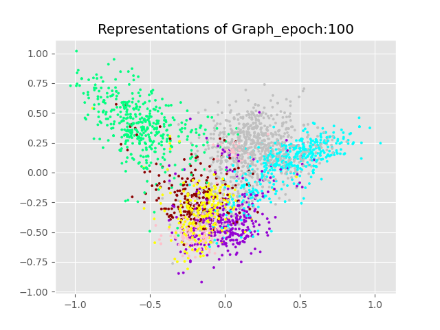
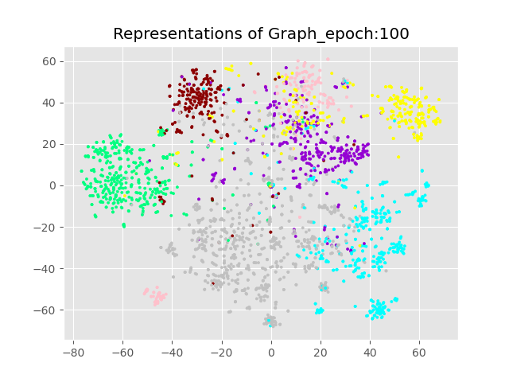

# Implementation of Deep Graph InfoMax in PyTorch
====

## How to extract local feature and global feature in Graph


## Usage

I compute F = 512 features in each layer, with the PReLU activation according to Paper.
```bash
python train.py --dataset cora
```

> initial configuration  
epochs: 100<br>
factor: 50<br>
lambda_param: 0.01<br>
learning_rate: 0.05


## Example  
```bash
python train.py --bias
```

## Terminal_Results

```bash
$ python train.py   
Loading cora dataset...
Epoch: 0001 loss_train: 0.6921 time: 2.2291s
Epoch: 0002 loss_train: 1.0717 time: 1.8863s
Epoch: 0003 loss_train: 0.8086 time: 1.8973s
Epoch: 0004 loss_train: 0.8917 time: 2.3387s
Epoch: 0005 loss_train: 0.7135 time: 2.0027s
.
.
.
Epoch: 0095 loss_train: 0.0408 time: 1.8570s
Epoch: 0096 loss_train: 0.0429 time: 1.8267s
Epoch: 0097 loss_train: 0.0425 time: 1.9485s
Epoch: 0098 loss_train: 0.0441 time: 1.7973s
Epoch: 0099 loss_train: 0.0392 time: 2.6459s
Epoch: 0100 loss_train: 0.0402 time: 2.6929s
Optimization Finished!
Total time elapsed: 207.5775s
classification Start
Accuracy: 0.8231801390647888
```
## Experiments 1. Corrupt function

- I consider alternatvies to corruption function used to produce negative graphs.
- So I implement two corruption function according to graph's labels.
- But Paper's Corruption function (row-wise shuffling of all X) is stable to my two corruption function.


## Experiments 2. Visualization by epoch (PCA, T-SNE)

1. PCA

- Epoch 0


- Epoch 20


- Epoch 100




2. T-SNE

- Epoch 0


- Epoch 20


- Epoch 100




## References

[1] Veličković, Petar, et al. "Deep graph infomax." arXiv preprint arXiv:1809.10341 (2018).
